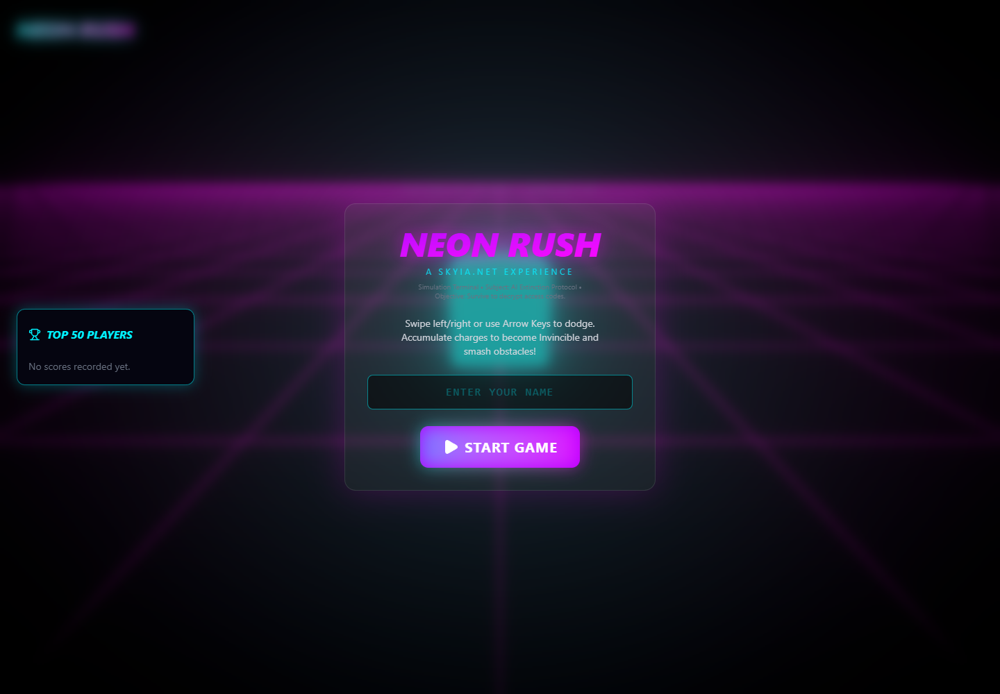
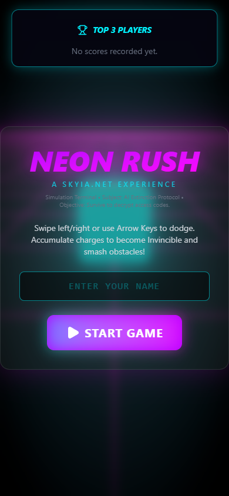

# Jeu 3D

Jeu navigateur 3D avec course, obstacles, score, niveaux, collisions, invincibilite, munitions, leaderboard local et codes promo SkyIA.

## Objectif

Tester une base de jeu 3D reutilisable et relier le gameplay a l'ecosysteme SkyIA.

## Fonctions principales

- Lance une scene 3D jouable.
- Gere les deplacements, collisions, score et niveaux.
- Ajoute charge, invincibilite, munitions et recompenses.
- Transforme certains scores en codes promo.

## Installation locale

```powershell
npm install
```

## Lancement

```powershell
npm run dev
npm run build
```

## Captures d'ecran





## Variables d'environnement

Copier `.env.example` vers `.env` en local puis remplir les valeurs privees.

## Securite

Ne jamais publier `.env`, tokens, sessions, logs sensibles, cles privees ou donnees personnelles.
